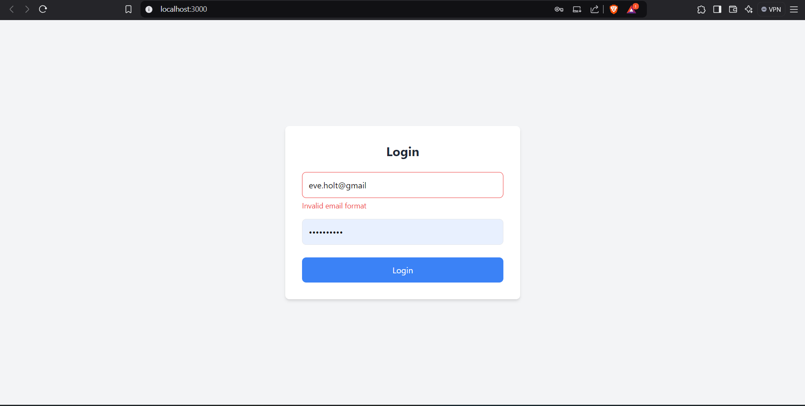
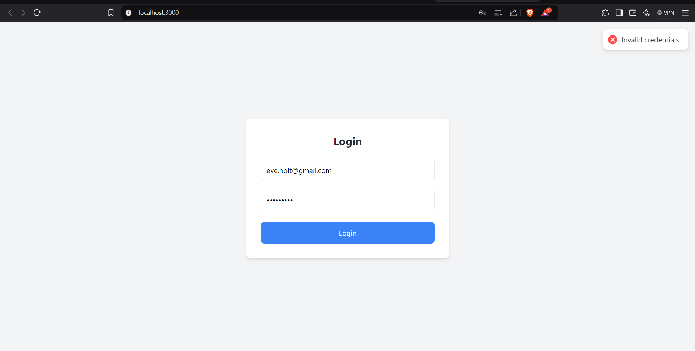
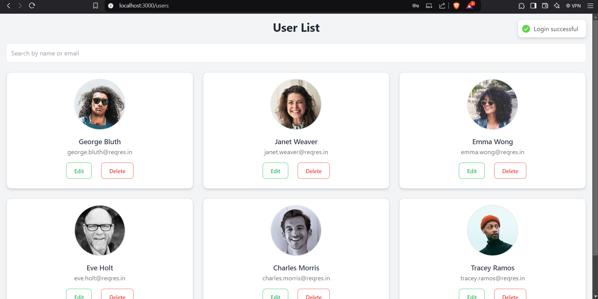
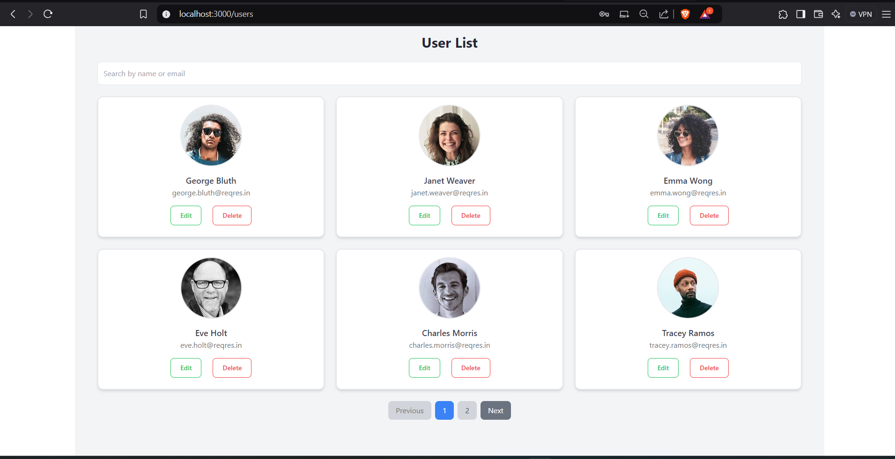
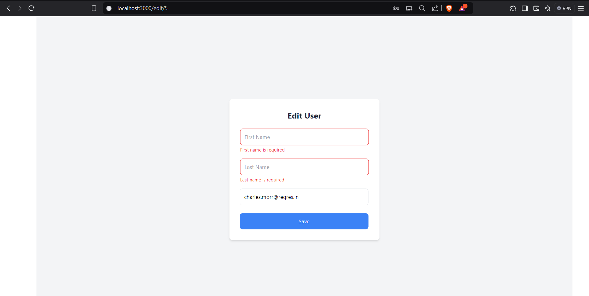
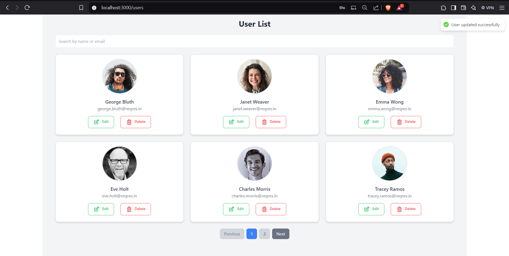
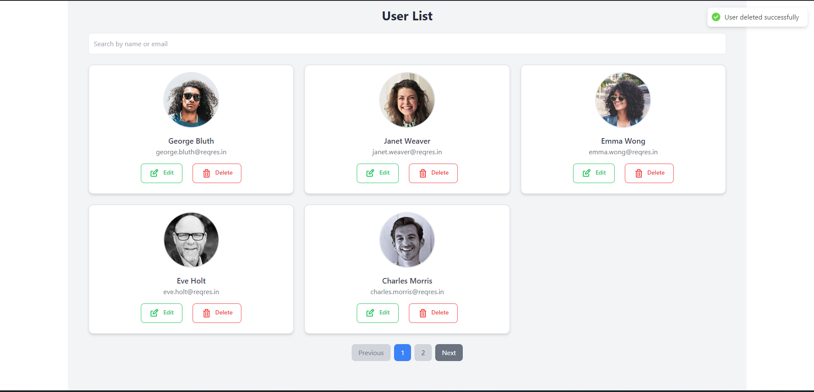
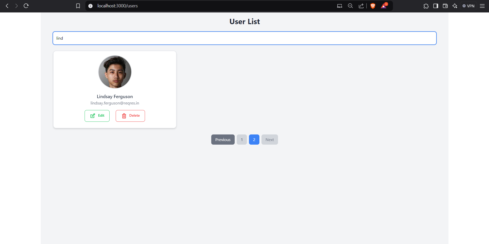

# User Management Application

## Deployed On Vercel
 Deployement Link (https://globalgroupware.vercel.app/)
## Overview
This project is a React-based user management application that integrates with the Reqres API to perform basic user management functions. It includes the following features:

- User Authentication
- Pagination
- Client-side search and filtering
- User editing and deletion

The application is built with React, styled using Tailwind CSS, and uses Axios for API integration.

---

## Prerequisites

Ensure you have the following installed:

- **Node.js** (v14 or higher)
- **npm** or **yarn** (for package management)

---

## Installation

Follow these steps to set up and run the project locally:

1. **Clone the Repository**:
   ```bash
   git clone <repository-url>
   cd <repository-folder>
   ```

2. **Install Dependencies**:
   ```bash
   npm install
   # or
   yarn install
   ```

3. **Start the Development Server**:
   ```bash
   npm start
   # or
   yarn start
   ```

4. **Access the Application**:
   Open your browser and navigate to:
   ```
   http://localhost:3000
   ```

---

## Features

### 1. **Authentication**
   - Users can log in with predefined credentials:
     - **Email**: `eve.holt@reqres.in`
     - **Password**: `cityslicka`
   - The login generates a token that is stored in localStorage.

### 2. **User List**
   - Displays a paginated list of users fetched from the Reqres API.
   - Users can navigate between pages.

### 3. **Client-side Search and Filtering**
   - Search bar filters users by their first name, last name, or email.

### 4. **Edit User**
   - Users can edit the details of a selected user.
   - After saving, the application redirects back to the same page.

### 5. **Delete User**
   - Users can delete any user from the list with instant feedback.

---

## Assumptions and Considerations

1. **API Endpoints**:
   - The application uses the [Reqres API](https://reqres.in/) for all user data operations.
   - The following endpoints are utilized:
     - `POST /api/login`: For authentication.
     - `GET /api/users?page=<page>`: Fetch paginated users.
     - `PUT /api/users/<id>`: Update user details.
     - `DELETE /api/users/<id>`: Delete a user.

2. **Styling**:
   - Tailwind CSS is used for responsive and consistent styling.

3. **State Management**:
   - React Hooks are used to manage state within components.

4. **Error Handling**:
   - Errors during API calls are displayed as toast notifications using React Hot Toast.

5. **Local Storage**:
   - The current page is stored in localStorage to ensure the user is redirected to the correct page after editing.

---

## Scripts

- **Start Development Server**:
  ```bash
  npm start
  ```

- **Build for Production**:
  ```bash
  npm run build
  ```

- **Run Tests**:
  ```bash
  npm test
  ```

---
 
Screenshots of the app
1. Login Screen with validation on required fields

2. Error message on invalid credentials

3. Successfully LoggedIn with success message

4. All Users List with Pagination

5. Edit User with prefilled values and validation

6. Successfully Edited user with success message

7. Delete user successfully

8.Search or FIlter users based on their Frst name, Last Name and Email
